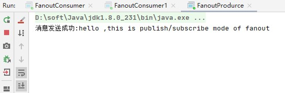
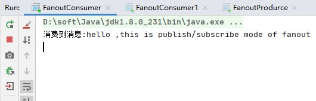
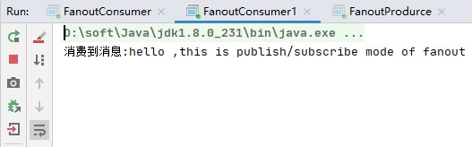

## 发布与订阅

在前面，我们创建了一个工作队列。工作队列背后的假设是，每个任务都恰好交付给一个消费者。在这一部分中，我们将做一些完全不同的事情-我们将消息传达给多个消费者。这种模式称为**“发布/订阅”**。

为了说明这种模式，我们将构建一个简单的日志记录系统。它由两个程序组成-第一个将发出日志消息，第二个将接收并打印它们。

在我们的日志系统中，接收器程序的每个运行副本都会获取消息。同时，都会讲消费到的消息打印出来。

本质上，已发布的日志消息将广播到所有接收者。

### 交换机

在本教程的前面部分中，我们向队列发送消息和从队列接收消息。现在是时候在Rabbit中介绍完整的消息传递模型了。

让我们快速回顾一下先前教程中介绍的内容：

- **生产者**是发送消息的用户的应用程序。
- **队列**是一个缓冲区，用于存储消息。
- **消费者**是接收消息的用户的应用程序。

RabbitMQ消息传递模型的核心思想是生产者从不将任何消息直接发送到队列。实际上，生产者经常甚至根本不知道是否将消息传递到任何队列。

相反，生产者只能将消息发送到**交换机**。交流是一件非常简单的事情。一方面，它接收来自生产者的消息，另一方面，将它们推入队列。交易所必须确切知道如何处理收到的消息。是否应将其附加到特定队列？是否应该将其附加到许多队列中？还是应该丢弃它。规则由**交换类型**定义 。


有几种交换类型可用：direct，topic，headers 和fanout。我们将集中讨论最后一个-扇出(fanout)。让我们创建这种类型的交换，并将其称为exchange：

```java
channel.exchangeDeclare("exchange"，"fanout");
```

扇出交换非常简单。正如您可能从名称中猜到的那样，它只是将接收到的所有消息广播到它知道的所有队列中。而这正是我们记录器所需要的。

#### 交换机列表

要列出服务器上的交换，您可以运行非常有用的rabbitmqctl：

```bash
sudo rabbitmqctl list_exchanges
```

在此列表中，将有一些amq.*交换和默认（未命名）交换。这些是默认创建的，但是目前您不太可能需要使用它们。

#### 无名交换

在本教程的前面部分中，我们对交换一无所知，但仍然能够将消息发送到队列。这是可能的，因为我们使用的是默认交换，我们通过空字符串（“”）进行标识。

回想一下我们之前如何发布消息：

```java
channel.basicPublish（"","hello",null,message.getBytes());
```

第一个参数是交换的名称。空字符串表示默认或*无名称*交换：消息将以routingKey指定的名称路由到队列（如果存在）。

现在，我们可以改为发布到命名交换：

```java
channel.basicPublish（"logs","",null,message.getBytes());
```


### 临时队列

您可能还记得，我们使用的是具有特定名称的队列（还记得hello和task_queue吗？）。能够命名队列对我们来说至关重要-我们需要将工人指向同一队列。当您想在生产者和消费者之间共享队列时，给队列命名很重要。

但这不是我们的记录器的情况。我们希望听到所有日志消息，而不仅仅是它们的一部分。我们也只对当前正在发送的消息感兴趣，而对旧消息不感兴趣。为了解决这个问题，我们需要两件事。

首先，无论何时连接到Rabbit，我们都需要一个全新的空队列。为此，我们可以创建一个具有随机名称的队列，或者甚至更好-让服务器为我们选择一个随机队列名称。

其次，一旦我们断开了使用者的连接，队列将被自动删除。

在Java客户端中，当我们不向queueDeclare()提供任何参数时，我们将 使用生成的名称创建一个非持久的，排他的，自动删除的队列：

```java
String queueName = channel.queueDeclare().getQueue();
```

您可以[在队列指南中](https://www.rabbitmq.com/queues.html)了解有关排他标志和其他队列属性的更多信息。

此时，queueName包含一个随机队列名称。例如，它可能看起来像amq.gen-JzTY20BRgKO-HjmUJj0wLg。


### 绑定


我们已经创建了一个扇出交换和一个队列。现在我们需要告诉交换机将消息发送到我们的队列。交换和队列之间的关系称为*绑定*。

```java
channel.queueBind(queueName, "logs", "");
```

从现在开始，日志交换将消息添加到我们的队列中。

#### 查看绑定列表

您可以使用猜测的方式列出现有绑定，

```bash
rabbitmqctl list_bindings
```


### 整合


产生消息的生产程序与上一教程看起来没有太大不同。最重要的变化是我们现在希望将消息发布到日志交换器，而不是无名的消息交换器。发送时，我们需要提供一个routingKey，但是对于扇出交换，它的值将被忽略。


#### 生产者代码如下:

```java
public class FanoutProdurce {

    public static void main(String[] args) throws IOException, TimeoutException {

        // 1. 创建exchange的名字
        String exchangeName = "exchange";

        // 2. 创建连接工厂
        ConnectionFactory connectionFactory = new ConnectionFactory();
        connectionFactory.setHost("127.0.0.1");
        connectionFactory.setPort(5672);
        connectionFactory.setVirtualHost("/");
        connectionFactory.setHandshakeTimeout(20000);

        // 3. 创建连接
        Connection connection = connectionFactory.newConnection();

        // 4. 创建通道
        Channel channel = connection.createChannel();

        // 5. 为通道声明exchange和exchange类型
        /*
         * exchangeDeclare(String exchangeName, String exchangeType)
         * exchangeName 交换机名称
         * exchangeType 交换机类型
         */
        channel.exchangeDeclare(exchangeName,"fanout");

        // 6. 发送消息到指定的exchange，队列指定为空，由exchange根据情况判断需要发送到哪些队列
        String msg = "hello ,this is publish/subscribe mode of fanout";
        /*
         *  basicPublish(String exchange, String routingKey, BasicProperties props, byte[] body)
         *  exchange 指定交换机 不指定则默认(AMQP default交换机)
         *  routingKey 路由键，即发布消息时，该消息的路由键是什么
         *  props 消息属性
         *  body 消息体
         */
        channel.basicPublish(exchangeName,"",null, msg.getBytes());
        System.out.println("消息发送成功:" + msg);

    }
}

```


消费者代码如下:

```java
public class FanoutConsumer {

    public static void main(String[] args) throws IOException, TimeoutException {

        // 1. 创建exchange的名字
        String exchangeName = "exchange";

        // 2. 创建连接工厂
        ConnectionFactory connectionFactory = new ConnectionFactory();
        connectionFactory.setHost("127.0.0.1");
        connectionFactory.setPort(5672);
        connectionFactory.setVirtualHost("/");
        connectionFactory.setHandshakeTimeout(20000);

        // 3. 创建连接
        Connection connection = connectionFactory.newConnection();

        // 4. 创建通道
        Channel channel = connection.createChannel();

        // 5. 为通道声明exchange和exchange类型
        /*
         * exchangeDeclare(String exchangeName, String exchangeType)
         * exchangeName 交换机名称
         * exchangeType 交换机类型
         */
        channel.exchangeDeclare(exchangeName,"fanout");

        // 6. 创建随机名字的queue
        String queue = channel.queueDeclare().getQueue();

        // 7. 创建exchange和queue的绑定关系
        /*
         * queueBind(String queueName, String exchangeName, String routingKey)
         * queueName 队列名称
         * exchangeName 交换机名称
         * routingKey 路由键
         */
        channel.queueBind(queue,exchangeName,"");

        // 8. 创建消费者
        Consumer consumer = new DefaultConsumer(channel) {
            @Override
            public void handleDelivery(String consumerTag, Envelope envelope, AMQP.BasicProperties properties, byte[] body) throws IOException {
                String msg = new String(body);
                System.out.println("消费到消息:" + msg);
            }
        };

        // 9. 消费消息
        /*
         * String basicConsume(String queue, boolean autoAck, Consumer callback )
         * queue  队列名字，即要从哪个队列中接收消息
         * autoAck 是否自动确认，默认true
         * callback 消费者，即谁接收消息
         */
        channel.basicConsume(queue,true,consumer);
    }
}

```

然后启动两个消费者，然后启动生产者。

#### 运行结果

生产者运行结果:



消费者1运行结果:



消费者2运行结果:




### 代码所在目录
[src/main/java/publishsubscribe/fanout](../src/main/java/publishsubscribe/fanout)