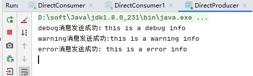
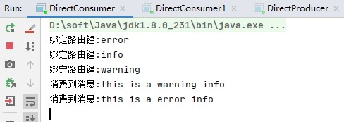
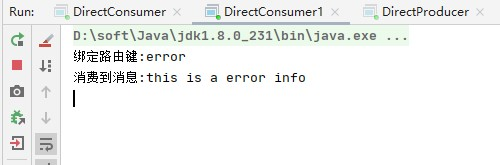

## 路由

在上一个教程中，我们构建了一个简单的日志记录系统。我们能够向许多接收者广播日志消息。

在本教程中，我们将向其中添加功能-我们将使仅订阅消息的子集成为可能。例如，我们将只能将严重错误消息定向到日志文件（以节省磁盘空间），同时仍然能够在控制台上打印所有日志消息。

### 绑定

在前面的示例中，我们已经在创建绑定。您可能会想起以下代码：

```java
channel.queueBind(queueName, EXCHANGE_NAME, "");
```

绑定是交换和队列之间的关系。可以简单地理解为：队列对来自此交换的消息感兴趣。

绑定可以采用额外的routingKey参数。为了避免与basic_publish参数混淆，我们将其称为 绑定键。这是我们如何使用键创建绑定的方法：

```java
channel.queueBind(queueName, EXCHANGE_NAME, "black");
```

绑定键的含义取决于交换类型。我们之前使用的 扇出交换只是忽略了它的价值。


### 直接绑定

上一教程中的日志系统将所有消息广播给所有使用者。我们想要扩展它以允许根据邮件的严重性过滤邮件。例如，我们可能希望将日志消息写入磁盘的程序仅接收严重错误，而不会在警告或信息日志消息上浪费磁盘空间。

我们使用的是扇出交换，它并没有给我们带来太大的灵活性-它只能进行无意识的广播。

我们将使用直接交换。直接交换背后的路由算法很简单-消息进入其绑定键与消息的路由键完全匹配的队列 。

为了说明这一点，请考虑以下设置。


在此设置中，我们可以看到绑定了两个队列的直接交换X。第一个队列由绑定键orange绑定，第二个队列有两个绑定，一个绑定键为black，另一个绑定为green。

在这样的设置中，通过路由键橙色发布到交换机的消息 将被路由到队列Q1。路由键为黑色 或绿色的消息将转到Q2。所有其他消息将被丢弃。


### 多重绑定


用相同的绑定键绑定多个队列是完全合法的。在我们的示例中，我们可以使用绑定键black在X和Q1之间添加绑定。在这种情况下，直接交换的行为类似于扇出，并将消息广播到所有匹配的队列。带有黑色路由键的消息将同时传递给 Q1和Q2。


### 发送消息

我们将在记录系统中使用此模型。我们将发送消息到直接交换机，而不是扇出。我们将提供日志严重性作为路由键。这样，接收程序将能够选择它想要接收的严重性。让我们首先关注发射日志。

与往常一样，我们需要首先创建一个交换：

```java
channel.exchangeDeclare(EXCHANGE_NAME, "direct");
```

我们已经准备好发送一条消息：

```java
channel.basicPublish(EXCHANGE_NAME,严重性,null,message.getBytes());
```

为简化起见，我们将假定“严重性”可以是“信息”，“警告”，“错误”之一。

### 接受消息

接收消息的工作原理与上一教程一样，但有一个例外-我们将为感兴趣的每种严重性创建一个新的绑定。

```java
String queueName = channel.queueDeclare().getQueue(); 
String[] bindingKeys = { "error", "info", "debug" };
for (String bindingKey : bindingKeys) {
    channel.queueBind(queue, EXCHANGE_NAME, bindingKey);
}
```


### 整合


生产者代码如下:

```java
public class DirectProducer {

    public static void main(String[] args) throws IOException, TimeoutException {
        // 1. 创建exchange的名字
        String exchangeName = "directExchange";

        // 2. 创建连接工厂
        ConnectionFactory connectionFactory = new ConnectionFactory();
        connectionFactory.setHost("127.0.0.1");
        connectionFactory.setPort(5672);
        connectionFactory.setVirtualHost("/");
        connectionFactory.setHandshakeTimeout(20000);

        // 3. 创建连接
        Connection connection = connectionFactory.newConnection();

        // 4. 创建通道
        Channel channel = connection.createChannel();

        // 5. 为通道声明exchange和exchange类型
        /*
         * exchangeDeclare(String exchangeName, String exchangeType)
         * exchangeName 交换机名称
         * exchangeType 交换机类型
         */
        channel.exchangeDeclare(exchangeName,"direct");

        // 6. 发送消息到指定的exchange，队列指定为空，由exchange根据情况判断需要发送到哪些队列
        /*
         *  basicPublish(String exchange, String routingKey, BasicProperties props, byte[] body)
         *  exchange 指定交换机 不指定则默认(AMQP default交换机)
         *  routingKey 路由键，即发布消息时，该消息的路由键是什么
         *  props 消息属性
         *  body 消息体
         */
        String msg = "this is a debug info";
        channel.basicPublish(exchangeName,"debug",null, msg.getBytes());
        System.out.println("debug消息发送成功：" + msg);

        msg = "this is a warning info";
        channel.basicPublish(exchangeName,"warning",null, msg.getBytes());
        System.out.println("warning消息发送成功:" + msg);

        msg = "this is a error info";
        channel.basicPublish(exchangeName,"error",null, msg.getBytes());
        System.out.println("error消息发送成功: "+ msg);

        // 7. 关闭channel和连接
        channel.close();
        connection.close();
    }
}

```


消费者1代码如下:

```java
public class DirectConsumer {

    public static void main(String[] args) throws IOException, TimeoutException {

        // 1. 创建exchange的名字
        String exchangeName = "directExchange";

        // 2. 创建连接工厂
        ConnectionFactory connectionFactory = new ConnectionFactory();
        connectionFactory.setHost("127.0.0.1");
        connectionFactory.setPort(5672);
        connectionFactory.setVirtualHost("/");
        connectionFactory.setHandshakeTimeout(20000);

        // 3. 创建连接
        Connection connection = connectionFactory.newConnection();

        // 4. 创建通道
        Channel channel = connection.createChannel();

        // 5. 为通道声明exchange和exchange类型
        /*
         * exchangeDeclare(String exchangeName, String exchangeType)
         * exchangeName 交换机名称
         * exchangeType 交换机类型
         */
        channel.exchangeDeclare(exchangeName,"direct");

        // 6. 创建随机名字的queue
        String queue = channel.queueDeclare().getQueue();

        // 7. 创建exchange和queue的绑定关系
        /*
         * queueBind(String queueName, String exchangeName, String routingKey)
         * queueName 队列名称
         * exchangeName 交换机名称
         * routingKey 路由键
         */
        String[] bindingKeys = { "error", "info", "warning" };
        for (String bindingKey : bindingKeys) {
            channel.queueBind(queue, exchangeName, bindingKey);
            System.out.println("绑定路由键:" + bindingKey);
        }

        // 8. 创建消费者
        Consumer consumer = new DefaultConsumer(channel) {
            @Override
            public void handleDelivery(String consumerTag, Envelope envelope, AMQP.BasicProperties properties, byte[] body) throws IOException {
                String msg = new String(body);
                System.out.println("消费到消息:" + msg);
            }
        };

        // 9. 消费消息
        /*
         * String basicConsume(String queue, boolean autoAck, Consumer callback )
         * queue  队列名字，即要从哪个队列中接收消息
         * autoAck 是否自动确认，默认true
         * callback 消费者，即谁接收消息
         */
        channel.basicConsume(queue,true,consumer);
    }
}

```


消费者2代码如下:

```java 
public class DirectConsumer1 {

    public static void main(String[] args) throws IOException, TimeoutException {

        // 1. 创建exchange的名字
        String exchangeName = "directExchange";

        // 2. 创建连接工厂
        ConnectionFactory connectionFactory = new ConnectionFactory();
        connectionFactory.setHost("127.0.0.1");
        connectionFactory.setPort(5672);
        connectionFactory.setVirtualHost("/");
        connectionFactory.setHandshakeTimeout(20000);

        // 3. 创建连接
        Connection connection = connectionFactory.newConnection();

        // 4. 创建通道
        Channel channel = connection.createChannel();

        // 5. 为通道声明exchange和exchange类型
        /*
         * exchangeDeclare(String exchangeName, String exchangeType)
         * exchangeName 交换机名称
         * exchangeType 交换机类型
         */
        channel.exchangeDeclare(exchangeName,"direct");

        // 6. 创建随机名字的queue
        String queue = channel.queueDeclare().getQueue();

        // 7. 创建exchange和queue的绑定关系
        /*
         * queueBind(String queueName, String exchangeName, String routingKey)
         * queueName 队列名称
         * exchangeName 交换机名称
         * routingKey 路由键
         */
        String[] bindingKeys = { "error"};
        for (String bindingKey : bindingKeys) {
            channel.queueBind(queue, exchangeName, bindingKey);
            System.out.println("绑定路由键:" + bindingKey);
        }

        // 8. 创建消费者
        Consumer consumer = new DefaultConsumer(channel) {
            @Override
            public void handleDelivery(String consumerTag, Envelope envelope, AMQP.BasicProperties properties, byte[] body) throws IOException {
                String msg = new String(body);
                System.out.println("消费到消息:" + msg);
            }
        };

        // 9. 消费消息
        /*
         * String basicConsume(String queue, boolean autoAck, Consumer callback )
         * queue  队列名字，即要从哪个队列中接收消息
         * autoAck 是否自动确认，默认true
         * callback 消费者，即谁接收消息
         */
        channel.basicConsume(queue,true,consumer);
    }
}

```


运行结果:

生产者结果:



消费者1结果:



消费者2结果:

