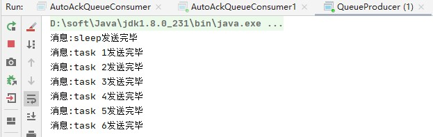
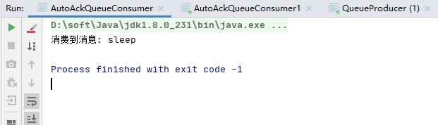
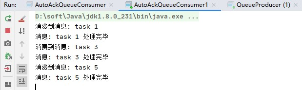
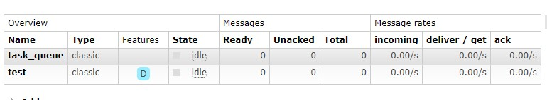
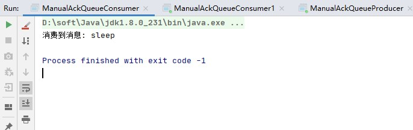
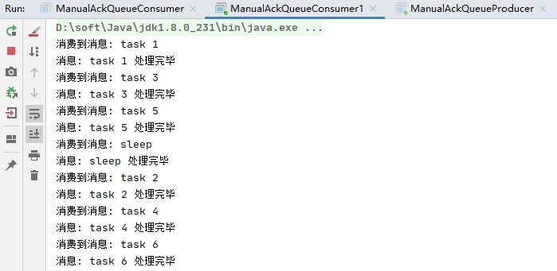
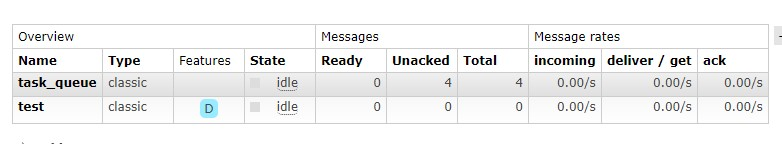

## 消息确认

完成一项任务可能需要几秒钟。您可能想知道，如果其中一个使用者开始一项漫长的任务并仅部分完成而死掉，会发生什么情况。使用我们当前的代码，**RabbitMQ一旦向消费者传递了一条消息，便立即将其标记为删除**。在这种情况下，如果您杀死一个工人，我们将丢失正在处理的消息。我们还将丢失所有发送给该特定工作人员但尚未处理的消息。

但是我们不想丢失任何任务。如果一个工人死亡，我们希望将任务交付给另一个工人。

为了确保消息永不丢失，RabbitMQ支持 [消息*确认*](https://www.rabbitmq.com/confirms.html)。消费者发送回确认，以告知RabbitMQ已经接收，处理了特定的消息，并且RabbitMQ可以自由删除它。

如果使用者在不发送确认的情况下死亡（其通道已关闭，连接已关闭或TCP连接丢失），RabbitMQ将了解消息未完全处理，并将对其重新排队。如果同时有其他消费者在线，它将很快将其重新分发给另一个消费者。这样，您可以确保即使工人偶尔死亡也不会丢失任何消息。

没有任何消息超时；消费者死亡时，RabbitMQ将重新传递消息。即使处理消息需要非常非常长的时间也没关系。

默认情况下，[手动消息确认](https://www.rabbitmq.com/confirms.html)处于打开状态。在前面的示例中，我们通过autoAck = true 标志显式关闭了它们。一旦我们完成了一项任务，就该将该标志设置为false并从工作人员发送适当的确认了。

## 自动消息确认

自动确认为true，每次RabbitMQ向消费者发送消息之后，会自动发确认消息（我工作你放心，不会有问题），这个时候消息会立即从内存中删除。如果工作者挂了，那将会**丢失它正在处理和未处理的所有工作，而且这些工作还不能再交由其他工作者处理，这种丢失属于客户端丢失。**

### 代码

生产者代码如下

```java
public class AutoAckQueueProducer {

    public static void main(String[] args) throws IOException, TimeoutException {
        // 1. 定义队列名称
        String queueName = "task_queue";
        String[] msgs = {"sleep", "task 1", "task 2", "task 3", "task 4", "task 5", "task 6"};

        // 2. 创建连接工厂
        ConnectionFactory connectionFactory = new ConnectionFactory();
        connectionFactory.setHost("127.0.0.1");
        connectionFactory.setPort(5672);
        connectionFactory.setVirtualHost("/");
        connectionFactory.setHandshakeTimeout(20000);

        // 3. 创建连接
        Connection connection = connectionFactory.newConnection();

        // 4. 创建channel
        Channel channel = connection.createChannel();

        // 5. 为channel设置队列
        /*
         * queueDeclare(String queue, boolean durable, boolean exclusive, boolean autoDelete, Map<String, Object> arguments)
         * queue 队列名
         * durable 该队列是否需要持久化
         * exclusive 该队列是否为该通道独占的（其他通道是否可以消费该队列）
         * autoDelete 该队列不再使用的时候，是否让RabbitMQ服务器自动删除掉
         * arguments 其他参数
         */
        channel.queueDeclare(queueName,false,false,false,null);

        // 6. 发送消息
        for (int i = 0; i < msgs.length; i++) {
            String msg = msgs[i];
            channel.basicPublish("",queueName,null,msg.getBytes());
            System.out.println("消息:" + msg +"发送完毕");
        }
    }
}
```

消费者代码如下:

```java
public class AutoAckQueueConsumer {

    public static void main(String[] args) throws IOException, TimeoutException {
        // 1. 定义队列名称
        String queueName = "task_queue";

        // 2. 创建连接工厂
        ConnectionFactory connectionFactory = new ConnectionFactory();
        connectionFactory.setHost("127.0.0.1");
        connectionFactory.setPort(5672);
        connectionFactory.setVirtualHost("/");
        connectionFactory.setHandshakeTimeout(20000);

        // 3. 创建连接
        Connection connection = connectionFactory.newConnection();

        // 4. 创建channel
        Channel channel = connection.createChannel();

        // 5. channel绑定queue
        /*
         * queueDeclare(String queue, boolean durable, boolean exclusive, boolean autoDelete, Map<String, Object> arguments)
         * queue 队列名
         * durable 该队列是否需要持久化
         * exclusive 该队列是否为该通道独占的（其他通道是否可以消费该队列）
         * autoDelete 该队列不再使用的时候，是否让RabbitMQ服务器自动删除掉
         * arguments 其他参数
         */
        channel.queueDeclare(queueName,false,false,false,null);

        // 6. 创建消费者
        Consumer consumer = new DefaultConsumer(channel) {
            @Override
            public void handleDelivery(String consumerTag, Envelope envelope, AMQP.BasicProperties properties, byte[] body) throws IOException {
                String msg = new String(body);
                doWork(msg);
            }
        };

        // 7. 消费消息
        /*
         * String basicConsume(String queue, boolean autoAck, Consumer callback )
         * queue  队列名字，即要从哪个队列中接收消息
         * autoAck 是否自动确认，默认true
         * callback 消费者，即谁接收消息
         */
        channel.basicConsume(queueName,true,consumer);
    }

    /**
     * 处理消息
     * @param msg 消息内容
     */
    private static void doWork(String msg){
        try {
            System.out.println("消费到消息: " + msg);
            // 通过sleep()来模拟需要耗时的操作
            if("sleep".equals(msg)){
                Thread.sleep(1000 * 60);
            }else{
                Thread.sleep(1000);
            }
            System.out.println("消息: " + msg +" 处理完毕");
        } catch (InterruptedException e) {
            e.printStackTrace();
        }
    }
}

```

将消费者的代码在拷贝一份，这样我们就有了两个消费者。


### 运行

首先我们先分表启动两个消费者，然后在启动生产者，去看看两个消费者消费的消息情况。因为我们写了如果消费到sleep将会阻塞1分钟，在阻塞的时候，我们将被阻塞的那个消费者杀掉，看看会发生什么情况

生产者运行结果:



消费者1运行结果



消费者2运行结果



rabbitmq的结果



### 结果---消息丢失

我们发现，消息生产者发送了7条消息，消费者1消费到了消息0,2,4,6。消费者2消息了消息1,3,5，而且是循环轮流分发到的，这种分发的方式就是循环分发。分发到之后，消费者1消费到了sleep消息，程序进行了阻塞，然后杀掉消费者1，我们发现消息2,4,6在rabbitmq里面已经消失了，我们也没有处理到，这样就造成了消失的丢失。

这是因为我们使用了默认的自动确认，rabbitmq只要将消息发送出去了就删除了，但是我们并没有来得及将其消费掉，造成了数据的丢失。


## 手动消息确认

为了应对这种情况，RabbitMQ支持消息确认。消费者处理完消息之后，会发送一个确认消息告诉RabbitMQ，消息处理完了，你可以删掉它了。

### 代码

生产者代码如下：

```java
public class ManualAckQueueProducer {

    public static void main(String[] args) throws IOException, TimeoutException {
        // 1. 定义队列名称
        String queueName = "task_queue";
        String[] msgs = {"sleep", "task 1", "task 2", "task 3", "task 4", "task 5", "task 6"};

        // 2. 创建连接工厂
        ConnectionFactory connectionFactory = new ConnectionFactory();
        connectionFactory.setHost("127.0.0.1");
        connectionFactory.setPort(5672);
        connectionFactory.setVirtualHost("/");
        connectionFactory.setHandshakeTimeout(20000);

        // 3. 创建连接
        Connection connection = connectionFactory.newConnection();

        // 4. 创建channel
        Channel channel = connection.createChannel();

        // 5. 为channel设置队列
        /*
         * queueDeclare(String queue, boolean durable, boolean exclusive, boolean autoDelete, Map<String, Object> arguments)
         * queue 队列名
         * durable 该队列是否需要持久化
         * exclusive 该队列是否为该通道独占的（其他通道是否可以消费该队列）
         * autoDelete 该队列不再使用的时候，是否让RabbitMQ服务器自动删除掉
         * arguments 其他参数
         */
        channel.queueDeclare(queueName,false,false,false,null);

        // 6. 发送消息
        for (int i = 0; i < msgs.length; i++) {
            String msg = msgs[i];
            channel.basicPublish("",queueName,null,msg.getBytes());
            System.out.println("消息:" + msg +"发送完毕");
        }
    }
}
```

消费者代码如下:

```java
public class ManualAckQueueConsumer {

    public static void main(String[] args) throws IOException, TimeoutException {
        // 1. 定义队列名称
        String queueName = "task_queue";

        // 2. 创建连接工厂
        ConnectionFactory connectionFactory = new ConnectionFactory();
        connectionFactory.setHost("127.0.0.1");
        connectionFactory.setPort(5672);
        connectionFactory.setVirtualHost("/");
        connectionFactory.setHandshakeTimeout(20000);

        // 3. 创建连接
        Connection connection = connectionFactory.newConnection();

        // 4. 创建channel
        Channel channel = connection.createChannel();

        // 5. channel绑定queue
        /*
         * queueDeclare(String queue, boolean durable, boolean exclusive, boolean autoDelete, Map<String, Object> arguments)
         * queue 队列名
         * durable 该队列是否需要持久化
         * exclusive 该队列是否为该通道独占的（其他通道是否可以消费该队列）
         * autoDelete 该队列不再使用的时候，是否让RabbitMQ服务器自动删除掉
         * arguments 其他参数
         */
        channel.queueDeclare(queueName,false,false,false,null);

        // 6. 创建消费者
        Consumer consumer = new DefaultConsumer(channel) {
            @Override
            public void handleDelivery(String consumerTag, Envelope envelope, AMQP.BasicProperties properties, byte[] body) throws IOException {
                String msg = new String(body);
                doWork(msg);
                // 手动消息确认
                channel.basicAck(envelope.getDeliveryTag(),true);
            }
        };

        // 7. 消费消息，将自动确认设为false
        /*
         * String basicConsume(String queue, boolean autoAck, Consumer callback )
         * queue  队列名字，即要从哪个队列中接收消息
         * autoAck 是否自动确认，默认true
         * callback 消费者，即谁接收消息
         */
        channel.basicConsume(queueName,false,consumer);
    }

    /**
     * 处理消息
     * @param msg 消息内容
     */
    private static void doWork(String msg){
        try {
            System.out.println("消费到消息: " + msg);
            // 通过sleep()来模拟需要耗时的操作
            if("sleep".equals(msg)){
                Thread.sleep(1000 * 60);
            }else{
                Thread.sleep(1000);
            }
            System.out.println("消息: " + msg +" 处理完毕");
        } catch (InterruptedException e) {
            e.printStackTrace();
        }
    }
}
```

### 运行

首先我们先分表启动两个消费者，然后在启动生产者，去看看两个消费者消费的消息情况。因为我们写了如果消费到sleep将会阻塞1分钟，在阻塞的时候，我们将被阻塞的那个消费者杀掉，看看会发生什么情况？

生产者运行结果


消费者1运行结果:



消费者2运行结果:



rabbitmq结果:



我们发现，消息生产者发送了7条消息，消费者1消费到了消息0,2,4,6。消费者2消息了消息1,3,5，而且是循环轮流分发到的，这种分发的方式就是循环分发。分发到之后，消费者1消费到了sleep消息，程序进行了阻塞，这时候我们可以看到rabbitmq里面还是有4条消息，即0,2,4,6这四条消息没有得到确认，然后杀掉消费者1，我们发现消费者2消费到了这4条消息，然后rabbitmq删除了所有成功消费的消息，这样就确保了消息不会丢失。

## 被遗忘的确认

错过basicAck是一个常见的错误。这是一个简单的错误，但是后果很严重。当您的客户端退出时，消息将被重新发送（看起来像是随机重新发送），但是RabbitMQ将消耗越来越多的内存，因为它将无法释放任何未确认的消息。

为了调试这种错误，您可以使用rabbitmqctl 打印messages_unacknowledged字段：

```bash
sudo rabbitmqctl list_queues名称messages_ready messages_unacknowledged
```

在windows上，删除sudo：

```bash
rabbitmqctl.bat list_queues名称messages_ready messages_unacknowledged
```