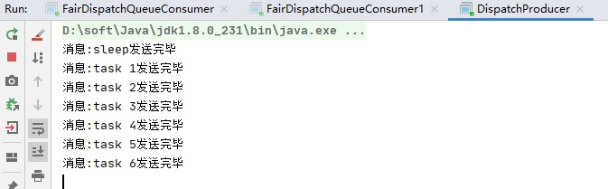
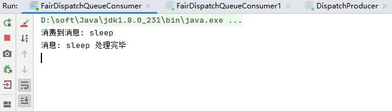
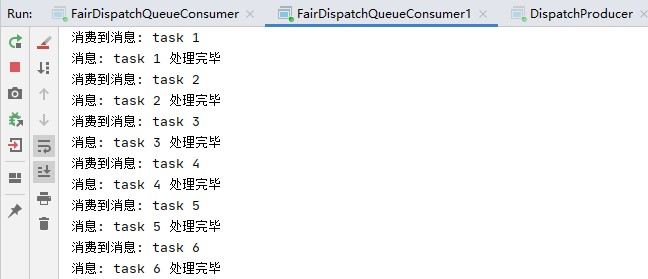

## 公平分发

您可能已经注意到，调度现在是多个消费者轮流来消费消息。例如，在有两名工人的情况下，当所有奇怪的消息都很重，甚至消息很轻时，一位工人将一直忙碌而另一位工人将几乎不做任何工作。好吧，RabbitMQ对此一无所知，并且仍将平均分配消息。

发生这种情况是因为RabbitMQ在消息进入队列时才调度消息。它不会查看消费者的未确认消息数。它只是盲目地将每个第n条消息发送给第n个使用者。


### 解决

为了解决这个问题，我们可以将basicQos方法与 prefetchCount = 1设置一起使用。这告诉RabbitMQ一次不要给工人一个以上的消息。换句话说，在处理并确认上一条消息之前，不要将新消息发送给工作人员。而是将其分派给尚不繁忙的下一个工作人员。

```java
int prefetchCount = 1 ;
channel.basicQos（prefetchCount）;
```


#### 关于队列大小的注意事项

如果所有工作人员都忙，则您的队列将满。您将需要关注这一点，并可能会增加更多的工作人员，或者有其他一些策略。


#### 注意

要想prefetchCount生效，必须使用手动确认，不能使用自动确认。因为如果自动确认，rabbitmq是无法确定消费者是否繁忙的，所有也无法指定消费者去消费消息。


### 代码

生产者代码如下:

```java
public class DispatchProducer {

    public static void main(String[] args) throws IOException, TimeoutException {
        // 1. 定义队列名称
        String queueName = "task_queue";
        String[] msgs = {"sleep", "task 1", "task 2", "task 3", "task 4", "task 5", "task 6"};

        // 2. 创建连接工厂
        ConnectionFactory connectionFactory = new ConnectionFactory();
        connectionFactory.setHost("127.0.0.1");
        connectionFactory.setPort(5672);
        connectionFactory.setVirtualHost("/");
        connectionFactory.setHandshakeTimeout(20000);

        // 3. 创建连接
        Connection connection = connectionFactory.newConnection();

        // 4. 创建channel
        Channel channel = connection.createChannel();

        // 5. 为channel设置队列
        /*
         * queueDeclare(String queue, boolean durable, boolean exclusive, boolean autoDelete, Map<String, Object> arguments)
         * queue 队列名
         * durable 该队列是否需要持久化
         * exclusive 该队列是否为该通道独占的（其他通道是否可以消费该队列）
         * autoDelete 该队列不再使用的时候，是否让RabbitMQ服务器自动删除掉
         * arguments 其他参数
         */
        channel.queueDeclare(queueName,false,false,false,null);

        // 6. 发送消息
        for (int i = 0; i < msgs.length; i++) {
            String msg = msgs[i];
            channel.basicPublish("",queueName,null,msg.getBytes());
            System.out.println("消息:" + msg +"发送完毕");
        }
    }
}
```

消费者代码如下：

```java
public class FairDispatchQueueConsumer {

    public static void main(String[] args) throws IOException, TimeoutException {
        // 1. 定义队列名称
        String queueName = "task_queue";

        // 2. 创建连接工厂
        ConnectionFactory connectionFactory = new ConnectionFactory();
        connectionFactory.setHost("127.0.0.1");
        connectionFactory.setPort(5672);
        connectionFactory.setVirtualHost("/");
        connectionFactory.setHandshakeTimeout(20000);

        // 3. 创建连接
        Connection connection = connectionFactory.newConnection();

        // 4. 创建channel
        Channel channel = connection.createChannel();

        // 5. channel绑定queue
        /*
         * queueDeclare(String queue, boolean durable, boolean exclusive, boolean autoDelete, Map<String, Object> arguments)
         * queue 队列名
         * durable 该队列是否需要持久化
         * exclusive 该队列是否为该通道独占的（其他通道是否可以消费该队列）
         * autoDelete 该队列不再使用的时候，是否让RabbitMQ服务器自动删除掉
         * arguments 其他参数
         */
        channel.queueDeclare(queueName,false,false,false,null);

        // 6. 创建消费者
        Consumer consumer = new DefaultConsumer(channel) {
            @Override
            public void handleDelivery(String consumerTag, Envelope envelope, AMQP.BasicProperties properties, byte[] body) throws IOException {
                String msg = new String(body);
                doWork(msg);
                // 手动消息确认
                channel.basicAck(envelope.getDeliveryTag(),true);
            }
        };

        // 告诉RabbitMQ 我每次值处理一条消息，你要等我处理完了再分给我下一个
        channel.basicQos(1);

        // 7. 消费消息
        /*
         * String basicConsume(String queue, boolean autoAck, Consumer callback )
         * queue  队列名字，即要从哪个队列中接收消息
         * autoAck 是否自动确认，默认true
         * callback 消费者，即谁接收消息
         */
        channel.basicConsume(queueName,false,consumer);
    }

    /**
     * 处理消息
     * @param msg 消息内容
     */
    private static void doWork(String msg){
        try {
            System.out.println("消费到消息: " + msg);
            // 通过sleep()来模拟需要耗时的操作
            if("sleep".equals(msg)){
                Thread.sleep(1000 * 60);
            }else{
                Thread.sleep(1000);
            }
            System.out.println("消息: " + msg +" 处理完毕");
        } catch (InterruptedException e) {
            e.printStackTrace();
        }
    }
}
```

### 运行结果

生产者运行结果



消费者1运行结果



消费者2运行结果



可以发现，rabbitmq将消息1发送到消费者1之后，消费者1进行了阻塞，然后将所有剩余的消息全都发送给了消费者2。